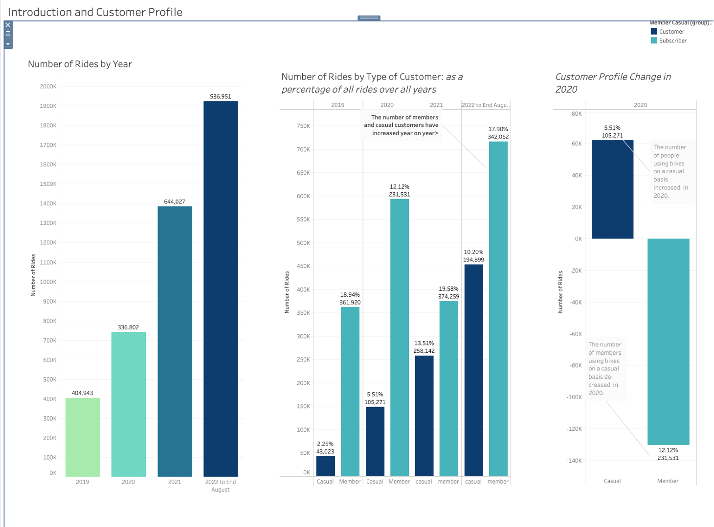
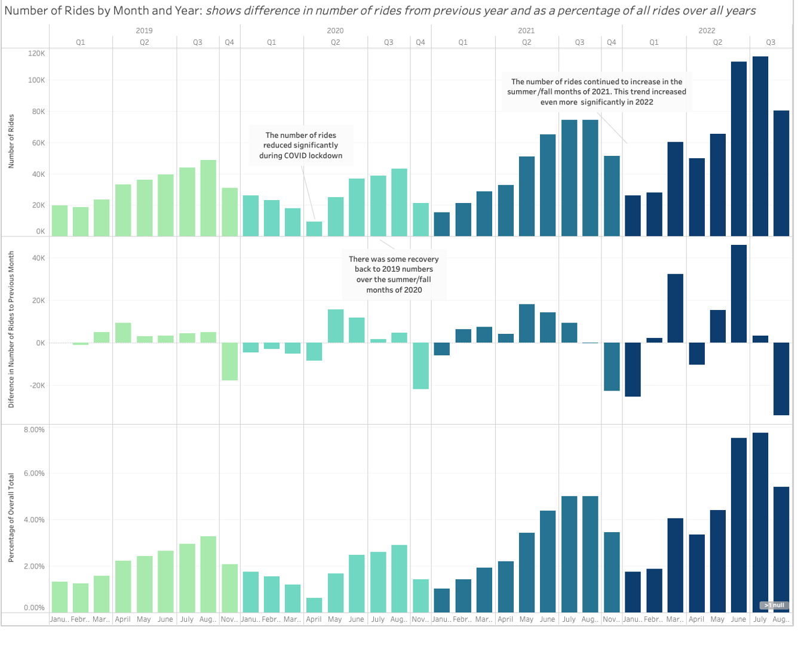
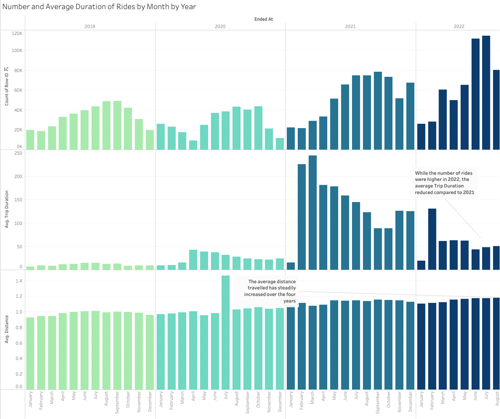
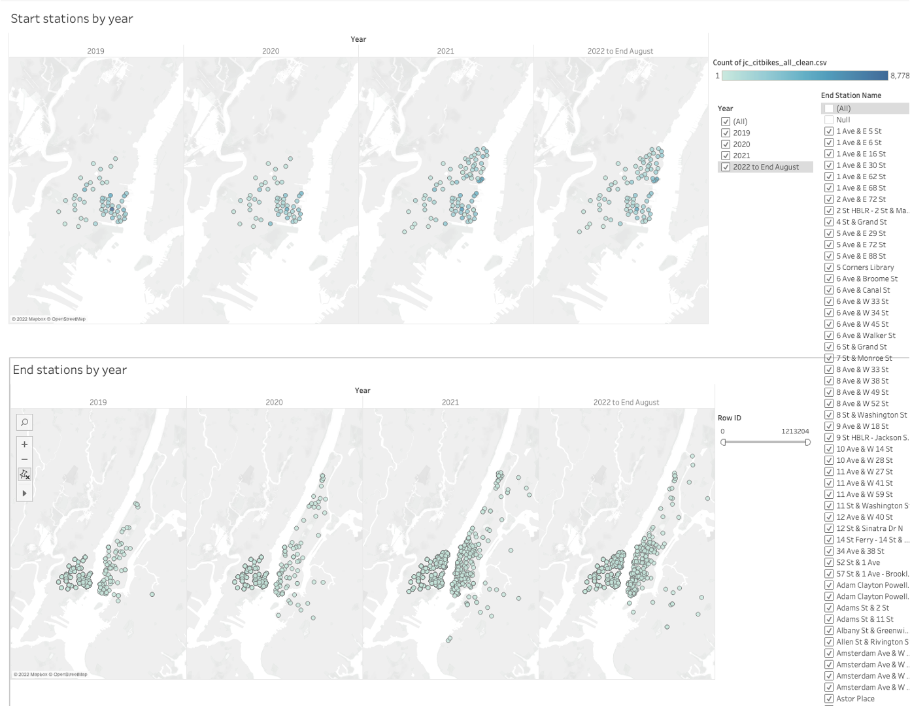
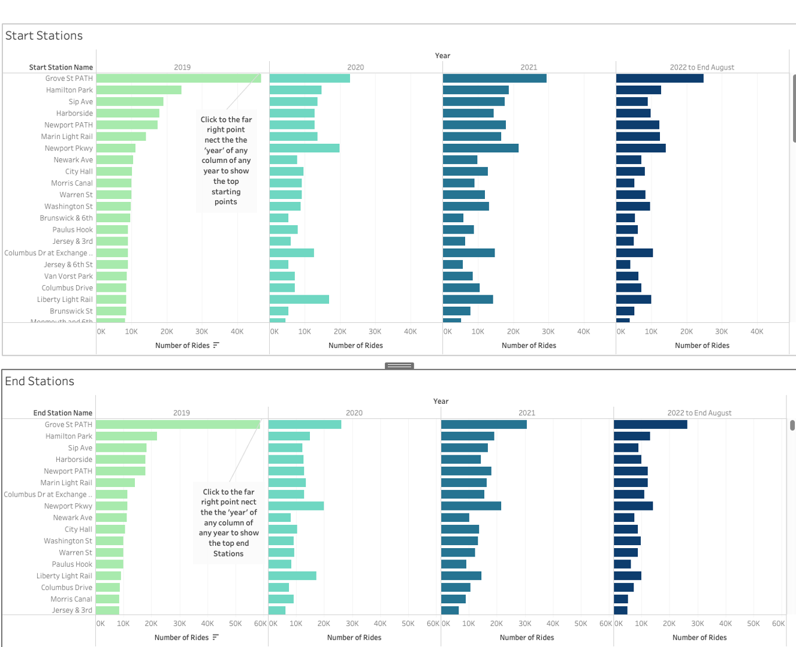
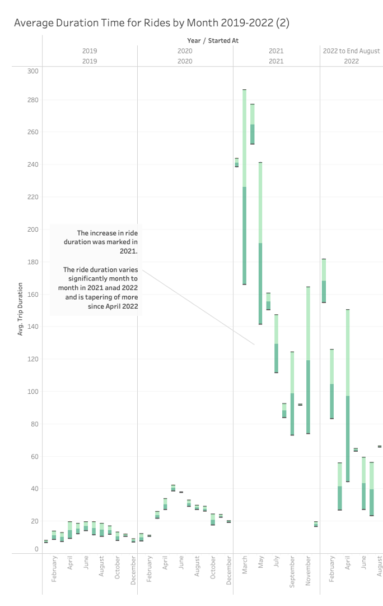
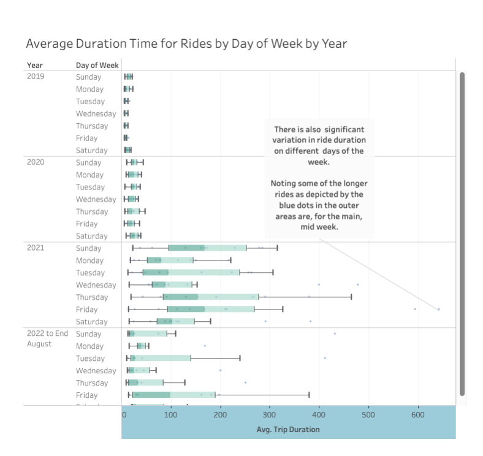
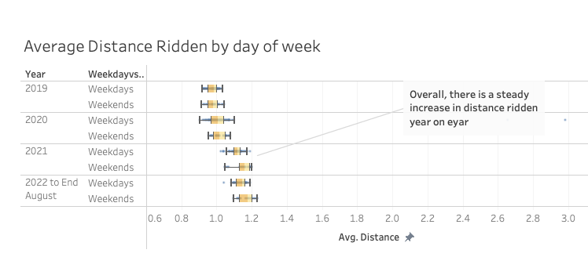

# Tableau-city-bikes

# Introduction

### Background and Context:

The purpose of this report is to visualize the Jersey City rental bike data for 2019 to 2020 to understand the impact of COVID on riding patterns, identify changes post-COVID and search for trends that can lead to actionable insights. A key insight is that since COVID, the number of rides around Jersey City has increased and that there are an increased number of people choosing to ride bikes from New Jersey to New York City. In a large city such as Jersey City, a diverse array of transportation options will always be necessary to serve the population and keep traffic congestion to a minimum. Bike rentals are one option of many and should be encouraged because of the availability of bike lanes and the benefit of being an environmentally friendly selection.

### Overview of the Data              

The citibike data was downloaded from citibikenyc.com. For this analysis. The website provides a cutdown version of data that relates to Jersey City. The time period chosen is January 2019 to August 2022. It is noted that the data set changed in February 2021 and a number of fields such as trip duration, gender and age were removed and new fields such as 'ride types' were introduced. The fields used in the analysis are listed below.

Trip Data:

* Started at: Start of trip date and time e.g. 1/24/2018 7:31:33 PM

* Ended at: Stop of trip date and time e.g. Stoptime1/24/2018 7:41:08 PM

* Start Station Id

* Start Station Name

* Start Station Latitude

* Start Station Longitude

* End Station Id

* *nd Station Name

* End Station Latitude

* End Station Longitude

* Usertype: User type for this trip (Member or Casual)

* *tarted At (Time Stamp date and time)

* Ended At (Time Stamp date and time)

New calculated fields include:

* Distance: Miles travelled 

* Weekend vs. Weekdays

### Limitations of the Data :

Tableau Public has a limitation in terms of the number of rows and size of the data sets. 

Data Types required changing to enable the transformation required for analysis.

The data set has significant anomalies with end and start dates missing; dates recorded incorrectly. 

Merging data from 44 csv files in two different data formats was challenging. 

### Methods 

The data aggregations and cleaning steps are set out in the Jupyter notebooks 

### Key Findings: 

#### More people are riding bikes in Jersey City since COVID and usage is increasing year on year- especially in the summer months.
#### There is significant variation in riding patterns by season, by month and on a daily basis. Deeper analysis would enable new insights that could inform urban development and business decisions

#### Number of rides and customer membership profile 

* Overall, the number of rides has increased year on year from 2019 to 2022.
* The number of casual customers has also increased.
* in 2020, the number of members using bikes decreased and the number of casual rides increased. This could be due to COVID where people who normally use bikes to commute were working from home and did not need to commute and those who normally take public transport may have chosen to ride instead to reduce risk of infection.

#### Number of Rides by Month and Year: shows the difference in the number of rides from the previous year and as a percentage of all rides over all years

* The number of rides reduced significantly during COVID lockdown in early 2020.
* There was some recovery back to 2019 numbers over the summer/fall months of 2020.
* The number of rides continued to increase in the summer/fall months of 2021. This trend continues even more significantly in 2022.

#### Number and Average Duration of Rides by Month by Year

* While the number of rides was higher in 2022, the average Trip Duration reduced compared to 2021. 
* The average distance travelled has steadily increased over the four years 

This could be indicative of bike-riding becomming more targetted and normalised as a form of transport for an increasing number of people.

#### The number of people riding from Jersey City to NYC has increased significantly since COVID and continues to do so, especially in the summer months.
Image of chart: 

#### Top Stations by Year 

* The top station has been Grove St Path across all Years 
* There is variation in activity by Station between 2019 and 2022 

#### Deeper Exploration of Ride Pattern - deeper exploration is required to better understand the drivers behind the variation in trends - this would be important for future planning 

* The Average duration of rides increased in 2021 but has trended down since April 2022
* The average duration by day of the week has varied significantly in 2021 and 2022  
* The average distance travelled has steadily increased year on year 

### Conclusion

More people are riding bikes in Jersey City since COVID and usage is increasing year on year- especially in the summer months. This could be indicative of bike-riding becomming more targetted and normalised as a form of transport for an increasing number of people. There is significant variation in riding patterns by season, by month and on a daily basis. Deeper analysis would enable new insights that could inform urban development and business decisions.

